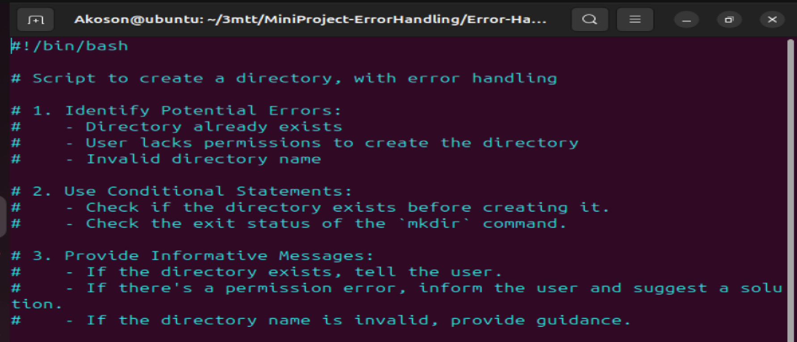
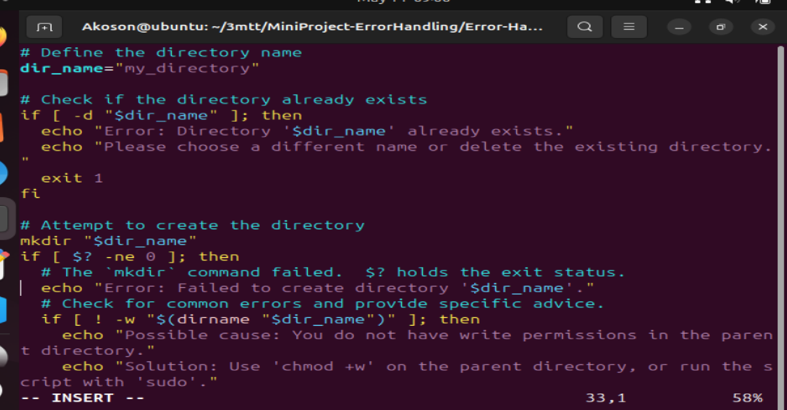
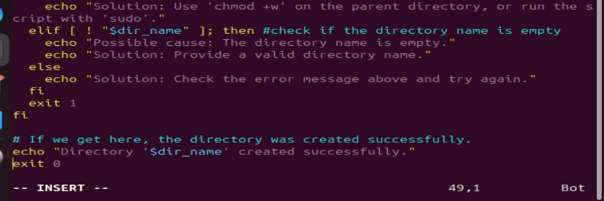
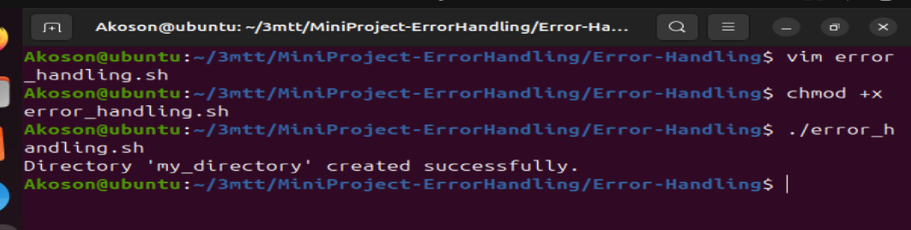
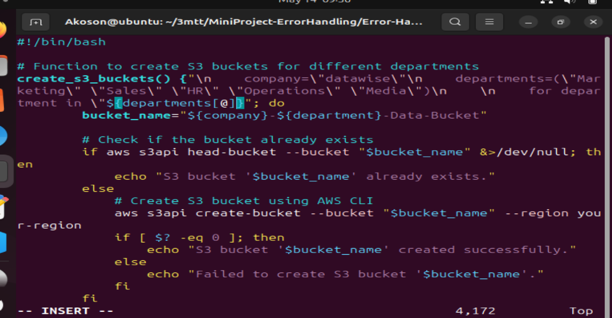
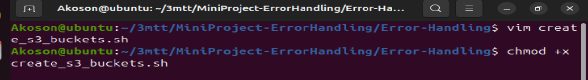
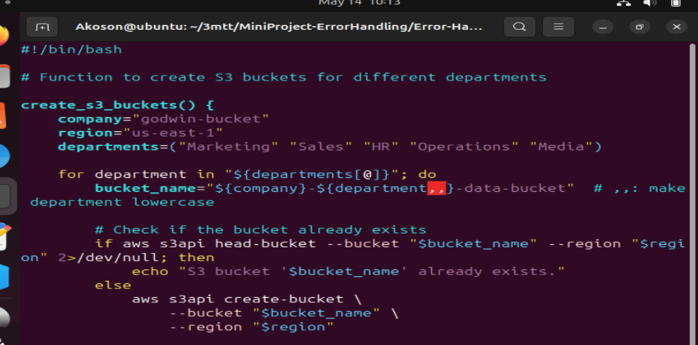
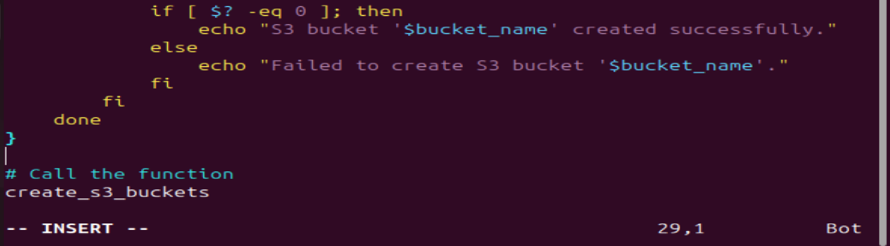
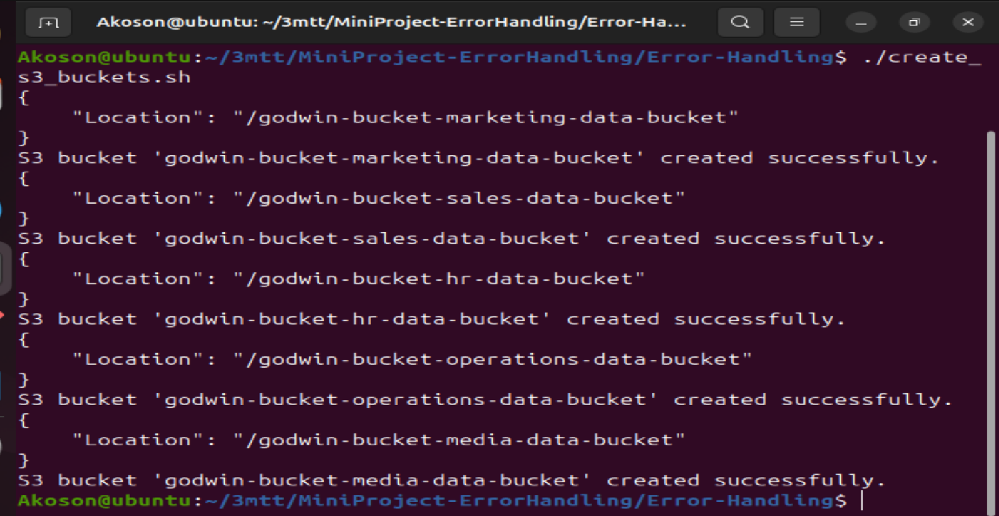
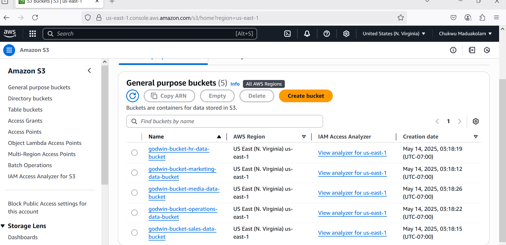

# Error-Handling

## Think of error handling in computer scripts like being careful when you're doing something important. If you're building something, you want to think about what could go wrong before it actually does. Maybe you don't have the right tools, or maybe you try to build something that's already there.

## Good scripts try to predict these problems. They use simple "if this, then that" logic to check if things are okay before moving on. If something goes wrong, instead of just stopping and confusing you, a good script will tell you clearly what the problem is and maybe even how to fix it.

## For example, if you're trying to create a storage box online (like an S3 bucket), the script should first check if a box with that name already exists. If it does, it should tell you, "Hey, that box is already there!" instead of trying to create it again and failing. This makes the script much more helpful and less likely to cause problems.

# Implementing Error Handling

## When implementing error handling in shell script ing, its essential to consider various scenerios and develope strategies to handle them effectively. Here are some key steps to think through and implement error handling.

## Identity Potential Errors:

### Begin by identifying potential sources of errors in your script, such as user input validation, command execution, or file operations. Anticipate scenerios where errors may occur and how could impact script execution.

## Use Conditional Statement:

### Utilize conditional statements (if, elif, else) to check for error conditions and respond accordingly. Evaluate the exit status ($?) of commandds to determine whether they executed successfully or encountered an error.

## Provide Information Message:

### When errors occur, provide descriptive error messages that clearly indicates what went wrong and how users can resolve the issue.

# Error Handling Examples:

# Handling S3 Bucket Existence Error:

## In the context of our script to create S3 buckets, an error scenario could arise if the bucket already existd when attempting to create it. To handle this error, we can modify the script to check if the bucket exists before attempting to create it. If the bucket already exits, we can display a message indicating that the bucket is already present.

## If you try to run your script more than once, you will end creating more EC2 instances than request and S3 bucket creation will fail because the bucket would already exist.

## So, you can be as creative as you like, by thinking about the different errors that may occur during script execution and then handle each one carefully.

## Here's an updated version of the create_s3_bucket function with error handling for existing buckets:

# Line-by-Line Explanation:

 ## #!/bin/bash
 ### This tells the computer to use the Bash shell to run the script.

 ## create_s3_buckets() {
## This defines a function called create_s3_buckets. All the bucket creation logic is inside this block.

## company="godwin-bucket"
### This sets the AWS region where the buckets will be created.

##     departments=("Marketing" "Sales" "HR" "Operations" "Media")
### This is a list of departments. We'll create one bucket for each department.

##     for department in "${departments[@]}"; do
### This starts a loop. It goes through each department one by one: Marketing, Sales, etc.

##         bucket_name="${company}-${department,,}-data-bucket"
### 

##         bucket_name="${company}-${department,,}-data-bucket"
### This creates the full name of the bucket by combining:

- the company name (godwin-bucket)

- the department name (converted to lowercase with ${department,,})

- and a suffix like -data-bucket

### Example:
godwin-bucket-marketing-data-bucket

##         if aws s3api head-bucket --bucket "$bucket_name" --region "$region" 2>/dev/null; then
### This checks if the bucket already exists using the AWS CLI.

##             echo "S3 bucket '$bucket_name' already exists."
### If it does exist, we just print a message and skip creating it again.

## else aws s3api create-bucket --bucket "$bucket_name" --region "$region"
### If the bucket does not exist, we try to create it using the AWS command.

##             if [ $? -eq 0 ]; then echo "S3 bucket '$bucket_name' created successfully."else
## echo "Failed to create S3 bucket '$bucket_name'."
## fi
### This checks if the create-bucket command worked ($? gives the result of the last command). If yes, we print success. If not, we print an error.

##     done
## }
### This closes the for loop and the function block.

## create_s3_buckets
### This line actually calls the function, so the bucket creation starts.

# In Summary:
## This script:

- Loops through 5 departments.

- Builds a custom bucket name for each one.

- Checks if the bucket already exists.

- Creates it if it doesn’t.

- Tells you whether it succeeded or failed.

